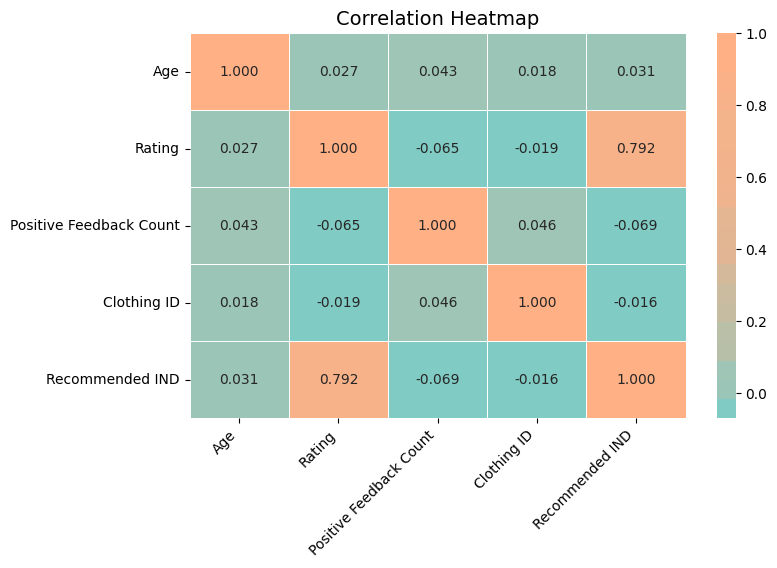
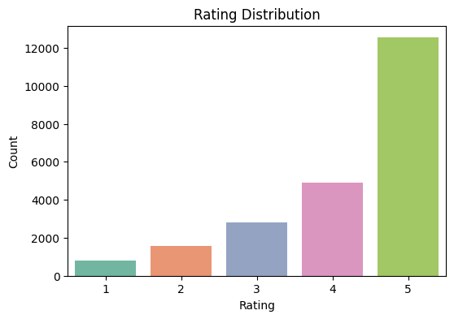
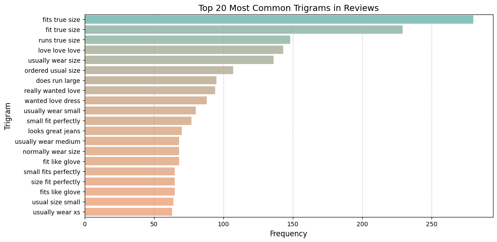
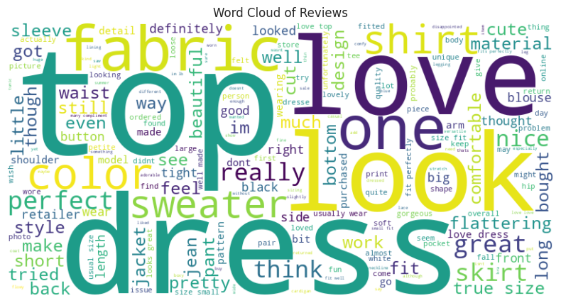
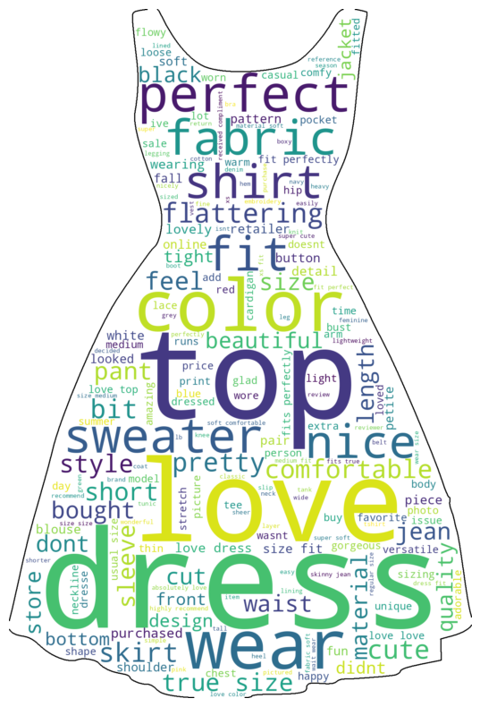
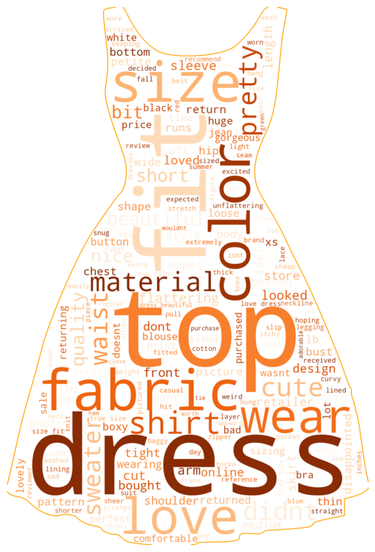
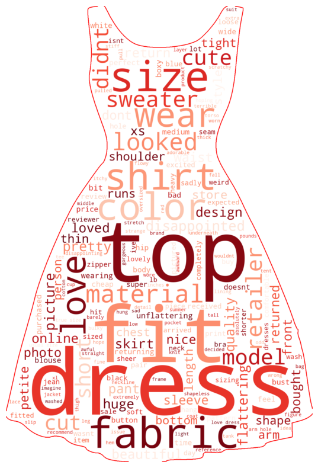
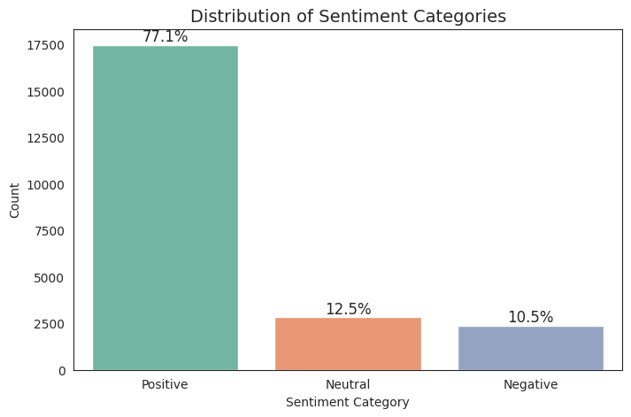
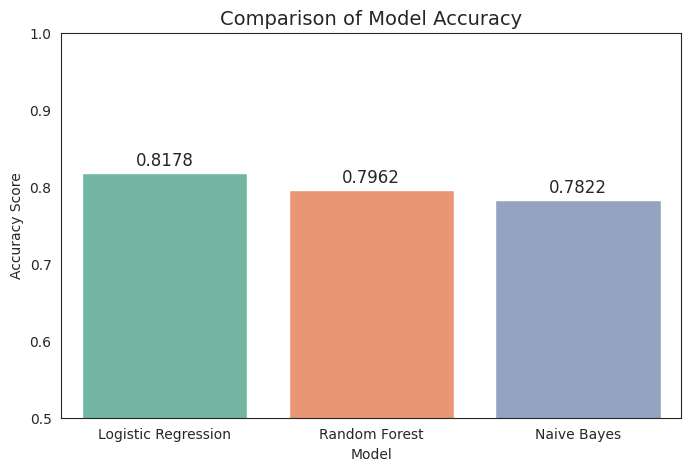
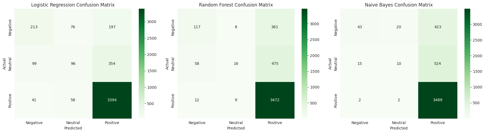

# 👗 Women's Clothing E-commerce Review Analysis

## Project Overview

This project aims to analyze customer reviews of women's clothing to uncover insights into:
- **Customer sentiment** and satisfaction
- Key product attributes (e.g. sizing, material, quality)
- Drivers of **product recommendations**
- Opportunities to improve e-commerce strategies

## Dataset Description

We conducted a comprehensive analysis of customer reviews from a **women's fashion e-commerce dataset** to understand product performance and customer feedback. The analysis includes:

📂 **Source**:  
[Women's E-Commerce Clothing Reviews (Kaggle)](https://www.kaggle.com/datasets/nicapotato/womens-ecommerce-clothing-reviews)

The dataset includes 23,000+ anonymized reviews containing:
- **Text-based fields** (Review Text, Title)
- **Numerical variables** (Rating, Age, Feedback Count)
- **Categorical variables** (Recommended, Department, Division)
  
## Scope of Analysis

### 1. Exploratory Data Analysis
- Distribution of ratings (1-5)
- Correlation between rating and recommendation  
<table>
  <tr>
    <td align="center">
      
    </td>
    <td align="center">
      
    </td>
  </tr>
</table>

### 2. Text Mining
- Word frequency analysis (unigrams, bigrams, trigrams)
- Word clouds to visualize common terms
- Identifying most discussed topics (e.g. size, fabric, fit)

<table>
  <tr>
    <td align="center">
      
       <em>Positive Reviews</em>
    </td>
    <td align="center">
      
       <em>Neutral Reviews</em>
    </td>
    <td align="center">
      
       <em>Negative Reviews</em>
    </td>
  </tr>
</table>

### 3. Sentiment Analysis
- Labeling sentiment as Positive (4–5), Neutral (3), or Negative (1–2)
- Visualization of sentiment distributions
- Classification using Logistic Regression, Naive Bayes, and Random Forest
- Accuracy comparison across models
- Use Logistric Regression to predict new review whether positive, neutral or negative
  
<!-- Full-width image (e.g., sentiment distribution) -->

  

 
<table>
  <tr>
    <td align="center">
      
    </td>
    <td align="center">
      
       <em>Confusion Matrix Overview</em>
    </td>
  </tr>
</table>

### 4. Predictive Modeling
- Combine TF-IDF text features with structured numerical features (Rating, Polarity, Subjectivity, Word Count, and Average Word Length)
- Use Random Forest model to classify product recommendation behavior (1 = Recommended, 0 = Not Recommended)
- Evaluating performance using accuracy score, classification report (overall accuracy = 0.94)

### 5. Topic Modeling
- Extracted latent topics using LDA to identify core customer concerns
- Topics focused on fit, comfort, style, and quality

## Tools & Libraries used
- **Python**
  - `pandas`, `numpy` – Data handling
  - `matplotlib`, `seaborn` – Visualization
  - `nltk`, `textblob` – Text preprocessing & sentiment
  - `sklearn` – ML models, evaluation metrics, LDA
  - `wordcloud`, `PIL` – Text visualization
 
## Business Implications
- **Targeted Marketing**: Highlighting highly-rated features (e.g. comfort, softness, flattering fit) can increase conversion.
- **Product Descriptions**: Retailers should include detailed sizing and material information to reduce fit-related dissatisfaction and return rates.
- **Personalized Recommendations**: create tailored shopping experiences based on customer preferences and feedback.

## 💡 Conclusion
This project showcased the power of combining Natural Language Processing (NLP) and machine learning to extract meaningful insights from customer reviews. By analyzing sentiment, identifying key drivers of recommendations, and building predictive models, we demonstrated how unstructured feedback can guide smarter product strategies, improve customer satisfaction, and support data-driven decision-making in the e-commerce space
